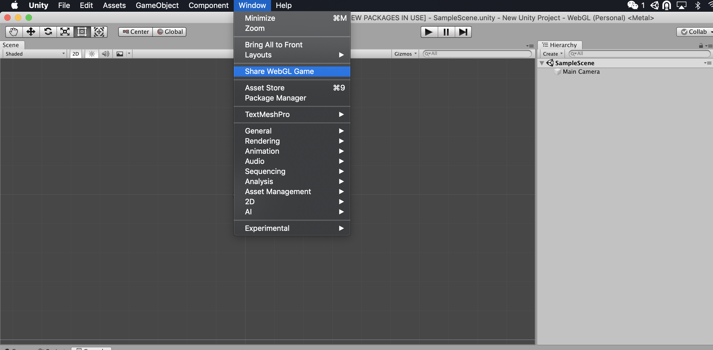
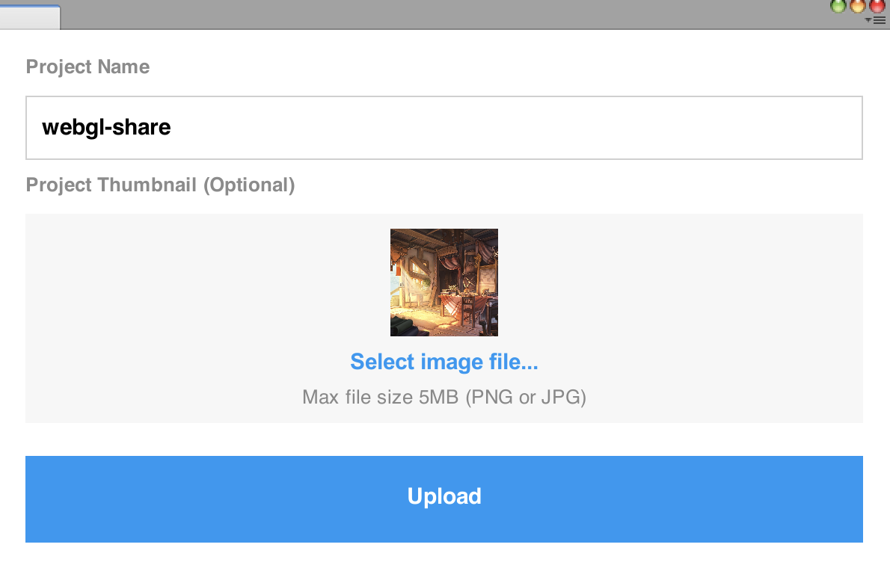
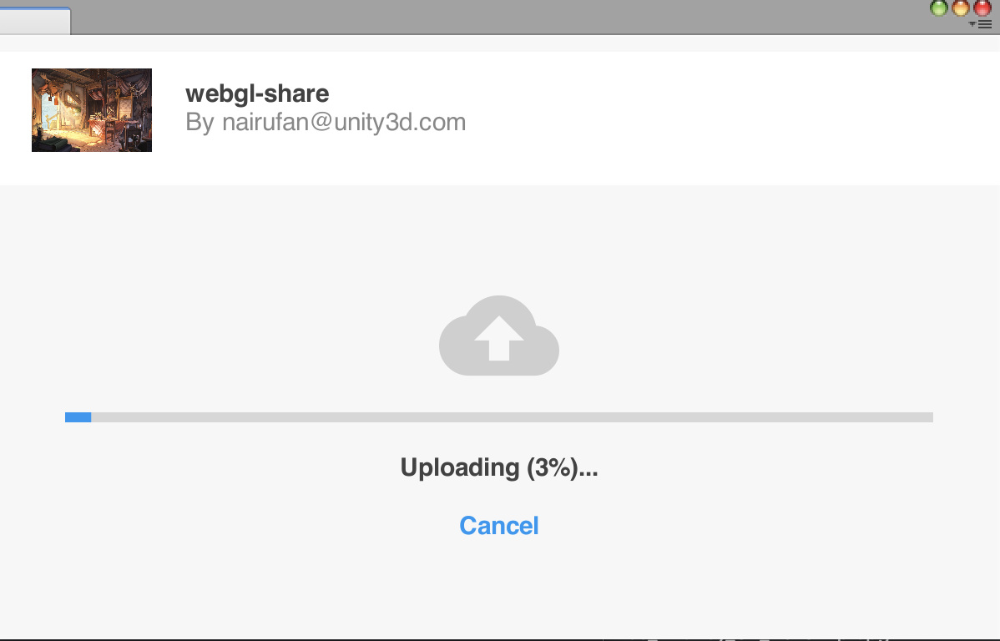
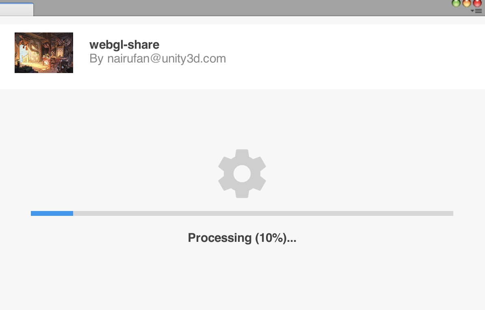
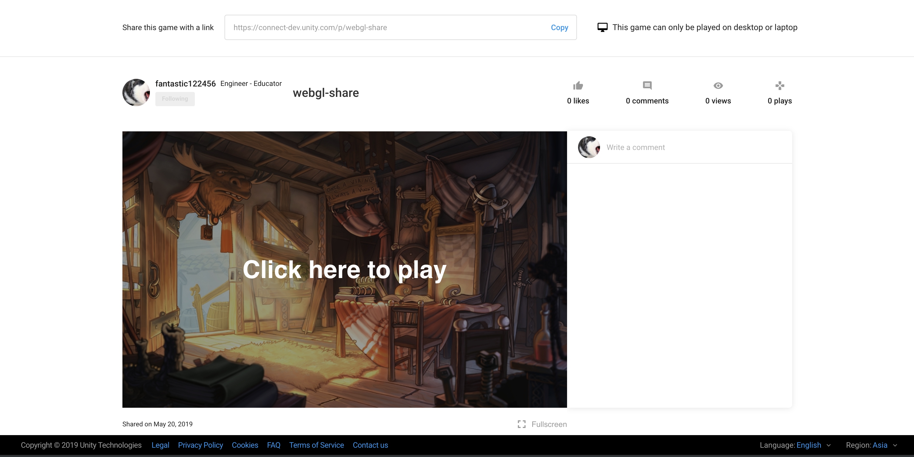

### **_Package Connect Share_**

Use the package connect share to upload and share your webgl game on connect.

### Pre-requisites
The Package Connect Share requires the UIWidgets 1.0.0 or later.

### Installation
To add the Package Connect Share to your project, please use the Package Manager UI to install the latest version of the package.

## Share Webgl Game
As shown below, once the connect share package is installed in your project, you can see a new sub menu `Share Webgl Game` on the menu bar Window.

 Click the `Share Webgl Game` menu option to initiate the upload and share process.Following screens will appear acording to your login and build status.
 - The package will check if you are logged in, if not it will ask you to login.
 - The package will check if you have built the webgl game, if not it will guide you to build the game.
 - Then you can update the project title and upload an thumbnail for the project.
 - After those steps you just need to click the upload button and wait for the game's webpage link.

 
 
 
 
 

# Technical details

## Requirements

This version of Connect Share is compatible with the following versions of the Unity Editor:

* 2018.3 and later (recomsmended)
